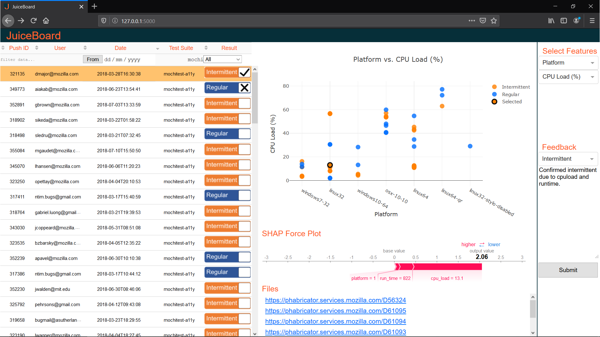

JuiceBoard is a dashboard web app developed using plotly's Dash. It allows the user to visualize machine learning classification data from classifying test failures as intermittent or regular failures as part of a continuous integration system. The data is contained in a postgresql database, imported as an sql dump. The database used for testing and devlopment was a snapshot of ML output data, from test suite data in Mozilla's treeherder platform.

To run JuiceBoard with the test database:

1.  Download repository
2.  Unzip postgresql/juiceboard.sql
3.  Follow README in docker/

Features:
*  Sort and filter data by pushid, user, date, testsuite or classification.
*  Visualize any two features of a particular job in the test suite.
*  View SHAP force plot for a particular job in the test suite.
*  Add feedback to confirm the test was classified correctly or not, and add comments.
*  View and open any files associated with the job.